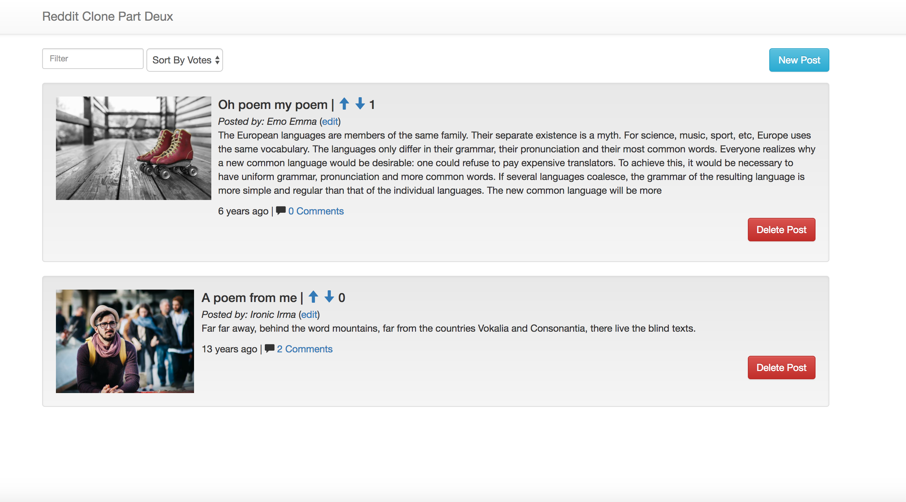
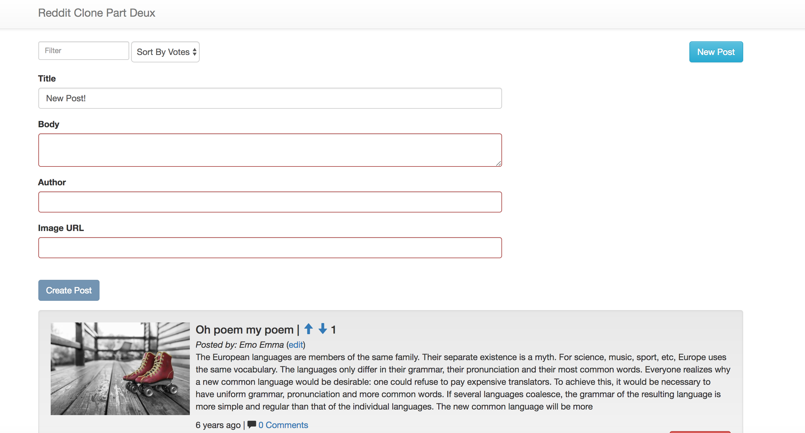
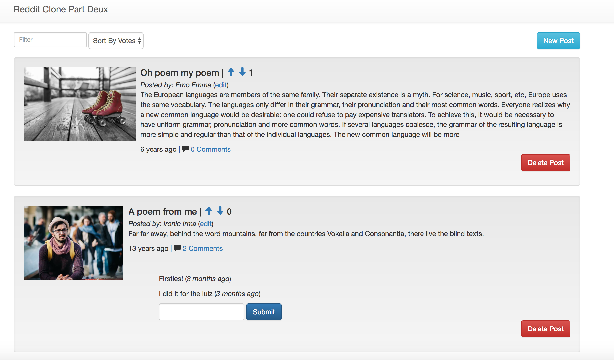
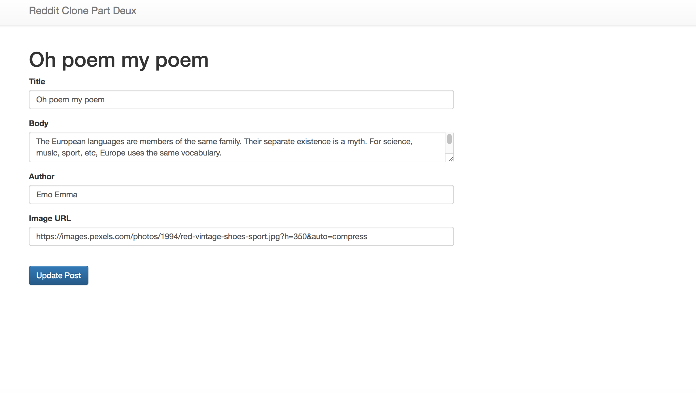

# Angular Reddit Clone

## Description

Web application designed for users to post, discuss and rate content. The goal of this project was to build a fully functioning CRUD (create, read, update, delete) application using Angular 1.6 for the frontend framework. This application was built over a week and a half and was also my first experience using Angular.

## Technologies Used

* [Angular 1.6](https://angularjs.org/) - Front-end web framework
* [Node.js](https://nodejs.org/en/) - Server-side scripting
* [Express](https://expressjs.com/) - Web application framework for Node.js
* [PostrgeSQL](https://www.postgresql.org/) - Relational database
* [Bootstrap](http://getbootstrap.com/) - Web app styling
* [Heroku](https://www.heroku.com/) - Web app deployment

## Deployed Site

https://ishamd-angular-reddit-clone.herokuapp.com/

## Views

### Landing Page

Users can scroll through, search, filter, vote or comment on existing content. Each post shows the author, time since the post was created, number of up-votes and a link to additional comments.

### New Post Form

Users can create a new post only once all form fields have been completed.

### Comment Form

Each individual post contains a link to a comment section. Clicking on the link allows users to see all existing comments and add their own.

### Edit Post Form

Users can edit individual posts. This feature was added to make the app a functioning CRUD application.

